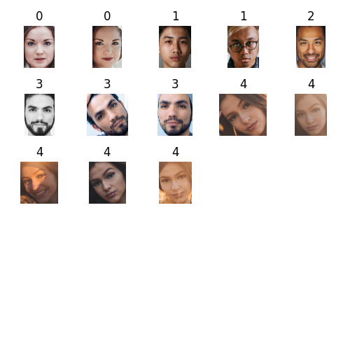

# Face Clustering using FaceNet

Convert face images detected in an image using [YOLOv5 model trained on faces](https://github.com/nadeemakhter0602/YOLOv5-Face-Detection) into 512 dimensional embeddings using [pre-trained models](https://github.com/davidsandberg/facenet#pre-trained-models) from [davidsandberg/facenet](https://github.com/davidsandberg/facenet).

The models were [converted into h5 files](https://github.com/nyoki-mtl/keras-facenet/blob/master/notebook/tf_to_keras.ipynb) and [ONNX files](https://github.com/onnx/tensorflow-onnx) to make inference using [tensorflow](https://www.tensorflow.org/) and [ONNXRuntime](https://onnxruntime.ai/) respectively faster and easier. The models are based on Inception ResNet v1 architecture but the final Dense layer in the original architecture is 128 neurons, however it is changed to 512 neurons for these models.

After converting the face images into 512 dimensional embeddings, [DBSCAN algorithm](https://en.wikipedia.org/wiki/DBSCAN) with an epsilon value of 0.5 and [cosine similarity](https://en.wikipedia.org/wiki/Cosine_similarity) as a metric is used to differentiate faces.

* Test results for FaceNet model trained on [VGGFace2 dataset](https://www.robots.ox.ac.uk/~vgg/data/vgg_face2/):

  
* Test results for FaceNet model trained on [CASIA WebFace dataset](http://www.cbsr.ia.ac.cn/english/casia-webFace/casia-webfAce_AgreEmeNtS.pdf):

  
